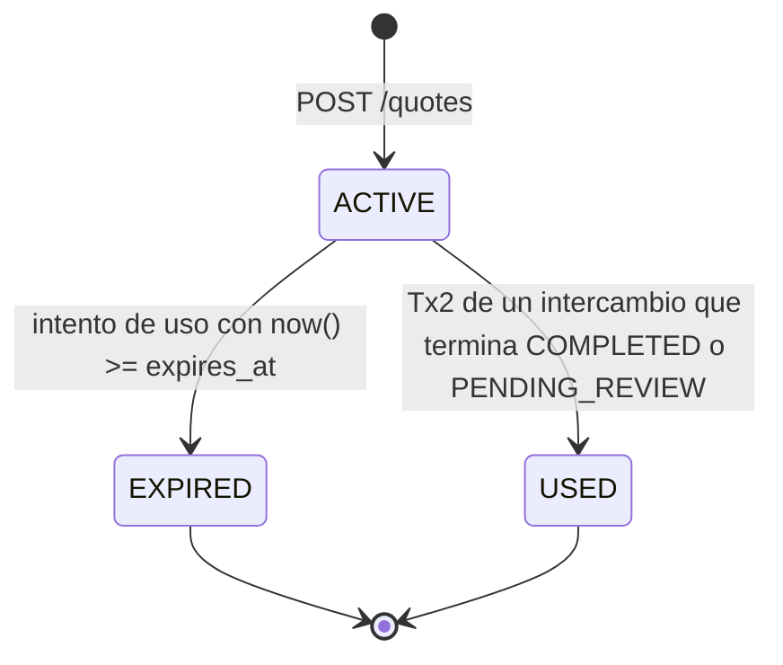
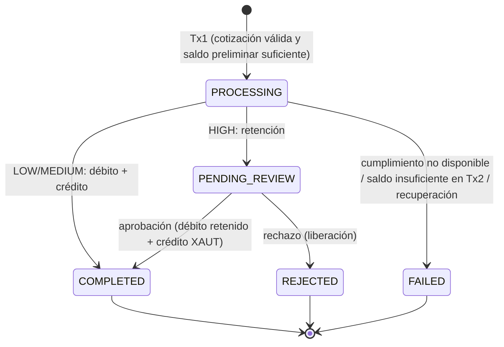

# Especificación funcional

Fuente: `docs/prueba_tecnica.pdf` (texto plano). Este documento fija **qué** hace el sistema; el **cómo** está en
`docs/plan.md`. El esquema de base de datos vive en `migrations/001_schema.sql`, que es la fuente de verdad.

Notación: **R** = regla del enunciado · **D** = decisión tomada · **S** = supuesto · **P** = pregunta abierta.

---

## 1. Reglas obligatorias del enunciado

| ID | Regla | Sección |
|---|---|---|
| R1 | Cada usuario tiene una wallet por activo (USDT-SBX y XAUT-SBX). | 2, 3.4 |
| R2 | Los saldos nunca son negativos y no se modifican directamente: todo cambio nace de un movimiento de ledger. | 3.4 |
| R3 | Los movimientos confirmados no se eliminan ni se sobrescriben. | 3.4 |
| R4 | Una misma operación no puede ejecutarse más de una vez. | 3.4 |
| R5 | Débito, crédito, movimientos y actualización de la operación se confirman o se revierten en una misma transacción. | 3.4 |
| R6 | Cálculos con decimales o enteros de precisión definida; nada de punto flotante binario. | 3.4 |
| R7 | Por wallet se registra: disponible, retenido y total. Por movimiento: tipo, referencia, fecha y hora, estado, saldo anterior y posterior. | 3.4 |
| R8 | Precio 1 XAUT-SBX = 2.500 USDT-SBX; comisión del 1 % sobre el origen, descontada antes de convertir; vigencia de 30 s; máximo 8 decimales; destino redondeado hacia abajo. | 3.6 |
| R9 | Una cotización vencida no se ejecuta, no se usa dos veces, guarda el precio y la comisión, y la ejecución usa lo almacenado sin recalcular. | 3.6 |
| R10 | Antes de ejecutar se consulta un servicio de cumplimiento desacoplado: < 1.000 → LOW; 1.000 a 5.000 inclusive → MEDIUM; > 5.000 → HIGH. | 3.7 |
| R11 | LOW se ejecuta. MEDIUM se ejecuta y queda marcada para seguimiento (COMPLETED, sin aprobación previa). HIGH se retiene hasta que Cumplimiento decida. | 3.7, 3.8 |
| R12 | Si el servicio de cumplimiento falla, la operación no afecta saldos y queda en un estado controlado. | 3.7 |
| R13 | Si se aprueba una HIGH: se debita lo retenido, se acredita XAUT y queda COMPLETED. Si se rechaza: se libera lo retenido, queda REJECTED y no se acredita nada. En ambos casos se conserva el precio original aunque la cotización haya vencido. | 3.8 |
| R14 | `Idempotency-Key` obligatoria en la creación del intercambio. Misma clave y mismo contenido → resultado original; misma clave y contenido distinto → 409. La clave se persiste. | 3.9 |
| R15 | Las transacciones y el control de concurrencia evitan que dos solicitudes consuman el mismo saldo. | 3.10 |
| R16 | Autenticación simplificada con `X-User-Id`: 401 si no identifica al usuario, 403 si no tiene permiso. | 3.2 |
| R17 | Datos semilla: user-001 (USER, 10.000 USDT-SBX) y compliance-001 (COMPLIANCE, 0/0). | 3.3 |
| R18 | Se respeta la sección 7 (fuera de alcance): sin frontend funcional, OIDC, order book, partida doble completa, microservicios ni observabilidad avanzada. | 7 |

## 2. Contradicciones y vacíos detectados en el enunciado

| # | Hallazgo | Resolución |
|---|---|---|
| C1 | El movimiento se define como "débito/crédito", pero HIGH necesita retener y liberar. | D1 |
| C2 | "Los saldos no se modifican directamente", pero la semilla da 10.000 USDT sin decir de dónde salen. | D2 |
| C3 | En un flujo síncrono, CREATED y PROCESSING no se distinguen. | D3 |
| C4 | Para HIGH dice "utilizada **o reservada**", pero no existe el estado RESERVED. | D4 |
| C5 | No define el redondeo de la comisión ni la precisión del monto de entrada. | D5 |
| C6 | En 3.2 el usuario "consulta sus operaciones", pero la API mínima no tiene un listado. | D6 |
| C7 | No dice qué pasa con la cotización ni con la clave de idempotencia si el servicio de cumplimiento falla. | D7, D11 |
| C8 | No aclara si el umbral de riesgo se aplica al monto bruto o al neto. | S1 |
| C9 | Formato: el archivo `.pdf` es texto plano; el texto de 3.3 está desordenado; las letras a–f de la sección 10 están separadas de sus preguntas. Se interpretan en orden. | — |

## 3. Decisiones

Cada decisión la tomó el autor; la justificación queda registrada para la sustentación.

**D1. Retención sin tipos HOLD/RELEASE.** Solo hay movimientos `DEBIT` y `CREDIT`, y cada uno indica qué saldo de la
wallet mueve (`balance_type` = `AVAILABLE` o `HELD`). Retener = DEBIT AVAILABLE + CREDIT HELD en la misma wallet;
liberar = DEBIT HELD + CREDIT AVAILABLE.
*Justificación:* respeta literalmente "tipo (débito/crédito)" y R2: ningún saldo, ni siquiera el retenido, cambia sin un
movimiento. El saldo anterior y el posterior se refieren al saldo afectado.

**D2. El saldo inicial es un movimiento.** Es un CREDIT AVAILABLE con `reference_type = INITIAL_DEPOSIT` y sin
operación asociada. Toda wallet nace en cero, y un trigger lo exige.
*Justificación:* cumple R2 desde el primer saldo y permite conciliar la suma del ledger contra el saldo de la wallet. El
README explica que en partida doble este crédito tendría su contrapartida en una cuenta de tesorería.

**D3. Estados del intercambio sin CREATED.** Toda operación nace en `PROCESSING` en la primera transacción, porque el
riesgo todavía no se conoce. Transiciones permitidas:
PROCESSING → COMPLETED | PENDING_REVIEW | FAILED; PENDING_REVIEW → COMPLETED | REJECTED.
*Justificación:* CREATED sería indistinguible de PROCESSING. Eliminarlo evita la ambigüedad, como permite la sección 5.
La base aplica la máquina de estados con un trigger.

**D4. No existe RESERVED.** Una cotización en `USED` nunca se reutiliza, incluso si la operación termina REJECTED.
*Justificación:* hay menos estados y menos transiciones. Una operación rechazada exige una nueva cotización con el
precio vigente.

**D5. Precisión y redondeos.** El monto de entrada acepta como máximo 8 decimales. La comisión se redondea **hacia
arriba** a 8 decimales y el monto destino **hacia abajo** a 8.
*Justificación:* 8 decimales es la precisión máxima del enunciado. Con ella, el 1 % puede dar 10 decimales, así que
hace falta un redondeo; hacia arriba y hacia abajo favorecen a la plataforma y nunca entregan más de lo cobrado. La
base vuelve a verificar ambas reglas con CHECKs exactos.

**D6. Listado de operaciones.** `GET /exchanges` devuelve solo las operaciones del usuario autenticado. COMPLIANCE ve
todas y puede filtrar con `?userId=`.
*Justificación:* cubre el "consultar sus operaciones" de 3.2, que la API mínima omite.

**D7. Falla del servicio de cumplimiento.** La operación queda `FAILED` (`failure_reason = COMPLIANCE_UNAVAILABLE`),
sin movimientos; se responde 503 y la cotización sigue disponible si no venció. No hay colas ni reintentos
automáticos; la estrategia de producción va en el README.
*Justificación:* es el "estado controlado" de R12. Que la cotización siga disponible evita castigar al usuario por una
falla interna.

**D8. La cotización se marca USED en la segunda transacción.** Un intercambio vivo por cotización lo garantiza un índice
único parcial `exchanges(quote_id) WHERE status <> 'FAILED'`.
*Justificación:* si la primera transacción la marcara USED, habría que revertirla tras una falla (D7), pero D4 prohíbe
USED → ACTIVE. Con el índice parcial, un intercambio FAILED libera la cotización sin cambiar su estado.

**D9. Dos transacciones, con la llamada a cumplimiento fuera de ambas.** Si el proceso se cae entre las dos, un
mecanismo de recuperación marcaría como FAILED las operaciones en PROCESSING más antiguas que un umbral. En la
prueba solo se documenta.
*Justificación:* no se retienen bloqueos de fila mientras se espera a un servicio que en producción sería externo y
lento.

**D10. Se conserva `compliance_decisions` y `exchanges` no copia montos.** Los montos y el precio se leen de la
cotización, cuyas columnas son inmutables por trigger (solo cambia `status`).
*Justificación:* la decisión de Cumplimiento es un registro de auditoría propio (revisor, decisión, motivo), como pide
3.2. Quitar la copia de montos elimina la posibilidad de que diverjan, y el trigger garantiza R9 ("usa la información
almacenada").

**D11. Idempotencia: qué se guarda y qué se libera.**

| Resultado | Clave | Por qué |
|---|---|---|
| 201 (COMPLETED o PENDING_REVIEW) | Se guarda la respuesta | Es el resultado definitivo de la operación. |
| 404 QUOTE_NOT_FOUND, 409 QUOTE_ALREADY_USED, 422 QUOTE_EXPIRED | Se guarda la respuesta | Reintentar con el mismo contenido daría siempre lo mismo. |
| 503 COMPLIANCE_UNAVAILABLE | **Se libera** (se borra la fila) | Es transitorio y la cotización sigue disponible (D7); el cliente reintenta con la misma clave. |
| 422 INSUFFICIENT_FUNDS (en cualquiera de las dos transacciones) | **Se libera** | Es transitorio: el saldo puede cambiar. Liberarla también en Tx1 hace que el mismo reintento dé el mismo resultado sin importar cuándo se detectó la falta de saldo (P1, confirmada). |
| 409 QUOTE_IN_USE (otro intercambio vivo sobre la cotización) | **Se libera** | Es transitorio: el otro intercambio puede terminar FAILED. |
| 400, 401, 403 | No se consume | Se rechaza antes de reservar la clave. |

La clave queda anotada en el intercambio (`exchanges.idempotency_key`) para auditoría, aunque la fila de
`idempotency_keys` se borre. Una respuesta reproducida lleva el encabezado `Idempotent-Replayed: true`.
La respuesta reproducida tiene el mismo status y el mismo contenido que la original; como se guarda en una columna `jsonb`, el
*orden* de las claves del JSON puede diferir, lo cual no afecta a ningún cliente que lea el JSON por nombre.

**D12. Monto mínimo implícito.** `POST /quotes` responde 422 `AMOUNT_TOO_SMALL` si el destino da 0 tras redondear. No
hay un mínimo arbitrario: la regla sale del cálculo, y el CHECK `target_amount > 0` la respalda.

**D13. Filtro de usuario.** En `GET /exchanges`, si un USER envía `?userId` con un id distinto del suyo, recibe 403; si
envía el suyo, se acepta.

**D14. Decisiones aceptadas a partir de las propuestas iniciales.**
- Códigos de respuesta según la sección 5.
- Vencimiento perezoso: no hay un job que expire cotizaciones; se marcan EXPIRED cuando alguien intenta usarlas. El
  TTL es configurable (`QUOTE_TTL_SECONDS`, 30 por defecto).
- El saldo se valida al ejecutar, no al cotizar.
- `GET /exchanges/:id` lo pueden ver el dueño y COMPLIANCE.
- Segregación de funciones: COMPLIANCE recibe 403 al cotizar o intercambiar, y USER recibe 403 en `/compliance/*`. La
  base exige además que el revisor de una decisión tenga rol COMPLIANCE.
- El motivo es obligatorio al rechazar y opcional al aprobar.
- El servicio de cumplimiento es un provider dentro de la app, detrás de una interfaz e inyectable; en pruebas se
  reemplaza por uno que falla.
- Montos con `decimal.js`.
- Se agregan pruebas ligeras de concurrencia si el tiempo alcanza.

**D15. Tres comandos.** `pnpm install`, `pnpm run up` (Postgres + migraciones + semilla + API) y `pnpm test`
(levanta Postgres si hace falta y prepara su propia base de pruebas).

**D16. Esquema único.** `migrations/001_schema.sql` es la fuente de verdad; no hay copia en `docs/`.

**D17. El rol COMPLIANCE también tiene wallets, siempre en cero.** `compliance-001` tiene sus dos wallets (USDT-SBX y
XAUT-SBX) con saldo 0, igual que cualquier otro usuario. Se evaluó la alternativa de crear wallets solo para el rol
USER y se descartó por las siguientes razones:

1. **Lo exige el enunciado, no es una inferencia.** La tabla de 3.3 lista a `compliance-001` con columnas
   "USDT-SBX disponible = 0" y "XAUT-SBX disponible = 0", y dice que la semilla debe contener "como mínimo" esos
   registros "conservando estos". Sin wallets, esas dos celdas no tendrían dónde existir. Además, 2 y 3.4 establecen
   que "cada usuario tiene una wallet independiente por activo", sin excluir a ningún rol.
2. **El rol es un atributo del usuario, no un tipo de entidad distinto.** El enunciado (3.2) pide que "el usuario y su
   rol existan previamente en la base de datos": hay una sola tabla `users` con una columna `role`. Mantener un único
   invariante, *todo usuario tiene una wallet por activo*, evita una regla especial ("las wallets dependen del rol")
   en la semilla, en la API y en las pruebas, y se verifica con una sola consulta.
3. **La segregación de funciones no depende de la ausencia de wallets, sino de los permisos**, y esos están aplicados
   en tres capas independientes:
   - *API:* COMPLIANCE recibe 403 en `POST /quotes` y `POST /exchanges` (D14). No puede originar ninguna operación.
   - *Ledger:* un saldo solo cambia con un movimiento (D1, R2), y los únicos movimientos que existen (depósito inicial
     de la semilla y los de un intercambio) nunca apuntan a las wallets de quien decide: aprobar o rechazar mueve las
     wallets **del dueño de la operación**, jamás las del revisor.
   - *Base de datos:* el revisor de una decisión debe tener rol COMPLIANCE (FK compuesta), y la tabla de decisiones es
     de solo inserción.
4. **No hay riesgo que mitigar.** No existe ningún endpoint de depósito ni de transferencia (S9; las transferencias
   son solo una pregunta de diseño). El saldo de esas wallets es 0 y no puede dejar de serlo. Que existan filas en
   cero no da a Cumplimiento ninguna capacidad ni ningún incentivo: tampoco puede aprobar sus propias operaciones,
   porque no puede crear ninguna.
5. **Quitarlas costaría más de lo que aporta.** Habría que condicionar la semilla por rol, devolver `[]` en
   `GET /wallets` para ese rol, reescribir pruebas ya hechas y separarse de la tabla de 3.3, que es lo primero que
   un evaluador comprobaría. Y si un usuario cambiara de rol, haría falta una migración de datos para crearle o
   quitarle wallets.
6. **Es verificable.** Las pruebas de aprobación y rechazo (T14) comprueban que, después de decidir, las wallets de
   `compliance-001` siguen en 0 y sin ningún movimiento de ledger. Si un cambio futuro hiciera que Cumplimiento
   recibiera o perdiera saldo, esa prueba fallaría.

*Límite que se declara en el README:* en una plataforma real, el personal de cumplimiento sería una identidad interna
(del backoffice) sin wallets de cliente, y la separación entre clientes y operadores estaría en el proveedor de
identidad. Aquí, con una autenticación simplificada y una sola tabla de usuarios, se conserva la uniformidad del
modelo y se hace cumplir la segregación con permisos.

**D18. Solo se soporta el par USDT-SBX → XAUT-SBX (un solo sentido).** `POST /quotes` acepta únicamente
`source_asset = USDT-SBX` y `target_asset = XAUT-SBX`. Cualquier otro valor (par invertido, mismo activo en ambos
lados, un activo desconocido o campos ausentes) da 400 `VALIDATION_ERROR` indicando el campo. No existe la venta de
XAUT-SBX por USDT-SBX.
*Justificación:*
1. **El enunciado define el flujo en una sola dirección.** La sección 2 dice que la plataforma "implementa un flujo de
   intercambio de USDT-SBX por XAUT-SBX" y la 3.6 que el usuario "solicita una cotización de USDT-SBX por XAUT-SBX".
2. **Todas las reglas están expresadas en USDT:** la comisión es "1 % sobre el monto en USDT-SBX, descontada del activo
   de origen" (3.6), los umbrales de riesgo son "Monto en USDT-SBX" (3.7) y el tratamiento HIGH mueve "el monto requerido"
   de USDT a retenido (3.8).
3. **El sentido contrario exigiría inventar reglas que el enunciado no da:** sobre qué activo se cobra la comisión, si
   los umbrales de 1.000 y 5.000 se aplican a XAUT o a su equivalente en USDT, qué dirección de redondeo es la segura
   para la plataforma, y qué saldo se retiene en un caso HIGH. La sección 7 pide no ampliar el alcance.
4. **Se piden los activos en el cuerpo de todos modos** porque 3.6 exige que la cotización registre "activo de origen y
   destino", y así el contrato de la API no cambia el día que se agregue otro par; hoy el único valor válido de cada
   campo es el del par soportado. Se responde 400 y no 422 porque es una violación del contrato (valor fuera del único
   permitido), no una regla de negocio que dependa del estado.
*Dónde está la restricción:* en el DTO (`@Equals`) y en las constantes `SOURCE_ASSET` / `TARGET_ASSET`; **no** en la base.
La tabla `quotes` ya es genérica (`source_asset`, `target_asset`, solo exige que sean distintos).
*Para soportar más pares (se declara en el README como evolución):* una tabla de pares con su precio, el activo sobre el
que se cobra la comisión y el activo en que se miden los umbrales de riesgo; y una regla de redondeo explícita por
sentido. Para que esa ampliación sea barata, la ejecución (T10–T12) debe leer los activos de la cotización guardada en
lugar de escribir `USDT-SBX` / `XAUT-SBX` a mano: el ledger, la retención y la idempotencia operan sobre wallets y
montos, no sobre activos concretos.

**D19. El servicio de cumplimiento es dueño de sus umbrales; la lógica principal solo confía en su respuesta.** Los
umbrales de R10 (< 1.000 LOW · 1.000 a 5.000 inclusive MEDIUM · > 5.000 HIGH) viven **únicamente** en el mock de
cumplimiento (`MockComplianceProvider`). El módulo de dinero (`common/money`) calcula comisión y destino, pero ya no
conoce niveles de riesgo, y el flujo de intercambio obtiene el riesgo siempre de lo que responde el servicio.
*Justificación:*
1. **R10 exige un servicio "desacoplado de la lógica principal".** Si el mock importara los umbrales del código de
   negocio, el "servicio externo" compartiría código con aquello de lo que debe estar desacoplado, y reemplazarlo por
   un proveedor real (Chainalysis, Sumsub) dejaría una copia de los umbrales sin dueño en nuestro código.
2. **Evita una fuente de verdad duplicada y silenciosa.** Si el flujo también calculara el riesgo por su cuenta, dos
   implementaciones podrían divergir sin que nada fallara. Con el contrato, el riesgo viene de un solo lugar.
3. **No se perdió nada:** `riskLevelFor` no la usaba ningún código de producción (solo sus pruebas), y las pruebas de
   fronteras (999,99 / 1.000 / 5.000 / 5.000,01) se movieron al mock, donde ahora ocurre la decisión.
4. **Los umbrales son del proveedor, no del contrato:** si Cumplimiento cambiara las bandas, cambiaría el proveedor, no
   el flujo de intercambio.

*Contrato interno con el servicio de cumplimiento* (`src/compliance-service/compliance.types.ts`; no es un endpoint HTTP):

| | |
|---|---|
| Entrada | `{ exchangeId, userId, sourceAsset, sourceAmount }`; `sourceAmount` es un string con el monto bruto de origen (S1). |
| Salida correcta | `{ riskLevel: 'LOW' \| 'MEDIUM' \| 'HIGH' }` |
| Cualquier otra cosa | Falla: el proveedor lanza, supera el tiempo máximo (`COMPLIANCE_TIMEOUT_MS`, 2.000 ms por defecto) o responde un nivel que no existe. |

`ComplianceClient.assess()` **nunca lanza**: devuelve `outcome: 'OK'` (con `riskLevel`) u `outcome: 'ERROR'` (con
`errorMessage`), y en ambos casos el proveedor, lo enviado, lo recibido y la duración en ms, que es exactamente lo que
guarda una fila de `compliance_checks`. Una respuesta inválida se trata como falla, igual que un timeout (D7). Se llama
siempre fuera de una transacción de base de datos.

---

## 4. Modelo de cálculo de la cotización

```
fee_amount    = ceil8(source_amount × 0,01)       -- D5: hacia arriba
net_amount    = source_amount − fee_amount
target_amount = floor8(net_amount ÷ 2.500)        -- R8: hacia abajo
risk_level    = lo responde el servicio de cumplimiento a partir de source_amount (S1: monto bruto; D19)
expires_at    = now() + 30 s                      -- hora de la base de datos
```

Ejemplo del enunciado: 2.500 USDT → comisión 25 → neto 2.475 → 0,99 XAUT (MEDIUM).

Dividir por 2.500 (= 2² · 5⁴) siempre da un resultado finito: un neto con 8 decimales produce como mucho 12, así que
el `floor8` opera sobre un valor exacto y no hay error acumulado.

## 5. API

Convenciones:
- Autenticación con el encabezado `X-User-Id`.
- Los montos viajan **como string** en las peticiones y en las respuestas (S3).
- Formato de error: `{ "error": { "code": "QUOTE_EXPIRED", "message": "…", "details": { … } } }`.

Errores comunes a todos los endpoints:

| Status | Código | Cuándo |
|---|---|---|
| 401 | `UNAUTHENTICATED` | Falta `X-User-Id` o el usuario no existe. |
| 403 | `FORBIDDEN` | El rol no permite la acción. |
| 400 | `VALIDATION_ERROR` | El cuerpo, los parámetros o los encabezados son inválidos. |

### 5.1 `GET /wallets`

Roles: USER y COMPLIANCE (S5, D17). Devuelve las wallets propias; para COMPLIANCE son sus dos wallets en cero.

- 200 → `[{ id, asset, available, held, total, updated_at }]`

### 5.2 `GET /wallets/:id/movements?limit=50`

Roles: USER y COMPLIANCE, sobre sus propias wallets. Devuelve los movimientos del más reciente al más antiguo (orden por
`id`). `limit` va de 1 a 200; por defecto 50.

- 200 → `[{ id, entry_type, balance_type, amount, balance_before, balance_after, status, reference_type, exchange_id, created_at }]`
- Los montos viajan como string. `id` del movimiento es un bigint y también viaja como string ("1", "2"…): crece sin
  parar y así no pierde precisión en JavaScript.
- 400 si el id no es un uuid o `limit` no es un entero de 1 a 200 (se rechazan `0`, `201`, `1.5`, `1e2`, `abc` y vacío).
- 404 `WALLET_NOT_FOUND` si la wallet no existe o es de otro usuario. Se usa 404 y no 403 para no revelar si existe.

### 5.3 `POST /quotes`

Rol: USER.

Cuerpo: `{ "source_asset": "USDT-SBX", "target_asset": "XAUT-SBX", "source_amount": "999.99" }`.

- 201 → `{ id, source_asset, target_asset, source_amount, price, fee_rate, fee_amount, net_amount, target_amount, status, created_at, expires_at }`
- 400 `VALIDATION_ERROR` si el monto no cumple `^\d{1,20}(\.\d{1,8})?$`, si es ≤ 0, si llega como número JSON (S3), o si
  el par no es USDT-SBX → XAUT-SBX.
- 403 si el rol es COMPLIANCE.
- 422 `AMOUNT_TOO_SMALL` si el destino da 0 tras redondear (D12).
- El cliente solo envía los activos y el monto: el precio, la comisión y la vigencia los fija el servidor. Una propiedad
  desconocida (`price`, `user_id`…) da 400.
- Los montos se devuelven siempre con 8 decimales (`"2500.00000000"`) y `fee_rate` con 6 (`"0.010000"`).
- La vigencia es `QUOTE_TTL_SECONDS` (30 por defecto), medida con el reloj de la base. Un valor inválido (`0`, `-5`,
  `abc`, `1.5`, vacío) impide arrancar la aplicación.
- Cotizar no exige saldo ni mueve saldos (D14): un usuario con 10.000 USDT puede cotizar 50.000.

### 5.4 `POST /exchanges`

Rol: USER. Encabezado obligatorio `Idempotency-Key` (de 1 a 255 caracteres). Cuerpo: `{ "quote_id": "<uuid>" }`.

| Status | Código / estado | Cuándo | ¿Se guarda bajo la clave? |
|---|---|---|---|
| 201 | `status: COMPLETED` | LOW o MEDIUM ejecutada (MEDIUM con `requires_follow_up: true`). | Sí |
| 201 | `status: PENDING_REVIEW` | HIGH retenida. | Sí |
| 400 | `VALIDATION_ERROR` | Falta la clave o el `quote_id` no es un uuid. | No |
| 403 | `FORBIDDEN` | El rol es COMPLIANCE. | No |
| 404 | `QUOTE_NOT_FOUND` | La cotización no existe o es de otro usuario. | Sí |
| 409 | `IDEMPOTENCY_KEY_MISMATCH` | La clave ya se usó con otro contenido. | — |
| 409 | `IDEMPOTENCY_IN_PROGRESS` | La petición original con esa clave aún no termina. | — |
| 409 | `QUOTE_ALREADY_USED` | La cotización está en USED. | Sí |
| 409 | `QUOTE_IN_USE` | Hay otro intercambio vivo (PROCESSING) sobre la cotización. | No (se libera) |
| 422 | `QUOTE_EXPIRED` | Venció (se marca EXPIRED). | Sí |
| 422 | `INSUFFICIENT_FUNDS` | El disponible es menor que `source_amount`. Si se detecta en la segunda transacción, la operación queda FAILED. | No (se libera) |
| 503 | `COMPLIANCE_UNAVAILABLE` | El servicio falló o superó el timeout; la operación queda FAILED y `details` incluye `exchange_id`. | No (se libera) |

Cuerpo de la respuesta 201: el mismo que `GET /exchanges/:id`.

### 5.5 `GET /exchanges?userId=`

Roles: USER (solo lo propio; D6 y D13) y COMPLIANCE (todo, con filtro opcional). Orden: lo más reciente primero.

- 200 → `[{ id, user_id, status, risk_level, requires_follow_up, source_amount, target_amount, created_at }]`
- 403 si un USER envía un `userId` ajeno.

### 5.6 `GET /exchanges/:id`

Roles: el dueño o COMPLIANCE. Devuelve el detalle completo y la trazabilidad de la operación:

```
{ id, user_id, status, risk_level, requires_follow_up, failure_reason, created_at, updated_at,
  quote: { id, source_asset, target_asset, source_amount, price, fee_rate, fee_amount, net_amount,
           target_amount, created_at, expires_at, status },
  movements: [...], compliance_checks: [...], decision: {...} | null, events: [...] }
```

- 404 `EXCHANGE_NOT_FOUND` si no existe o un USER pide una ajena.

### 5.7 `GET /compliance/exchanges/pending`

Rol: COMPLIANCE. Devuelve las operaciones en PENDING_REVIEW, de la más antigua a la más reciente.

- 200 → `[{ id, user_id, user_name, source_asset, source_amount, target_asset, target_amount, price, risk_level, created_at }]`

### 5.8 `PATCH /compliance/exchanges/:id/approve`

Rol: COMPLIANCE. Cuerpo opcional `{ "reason": "…" }`.

- 200 → detalle de la operación (COMPLETED).
- 404 `EXCHANGE_NOT_FOUND`.
- 409 `EXCHANGE_NOT_PENDING` si no está en PENDING_REVIEW (incluye la decisión duplicada o concurrente).

### 5.9 `PATCH /compliance/exchanges/:id/reject`

Rol: COMPLIANCE. Cuerpo `{ "reason": "…" }`, obligatorio y no vacío.

- 200 → detalle de la operación (REJECTED).
- 400 si falta el motivo.
- 404 si no existe.
- 409 `EXCHANGE_NOT_PENDING`.

Documentación navegable: Swagger UI en `/docs`.

## 6. Estados y transiciones

### 6.1 Cotización



- Una cotización en ACTIVE con un intercambio FAILED sigue en ACTIVE (D7, D8).
- Ningún estado vuelve atrás; lo exige el trigger `quotes_guard_update`.
- El vencimiento se evalúa **solo en la primera transacción**. Si la cotización vence mientras la llamada a cumplimiento
  está en curso, la segunda transacción la marca USED igual, porque la operación fue aceptada dentro de la vigencia.

### 6.2 Intercambio



| Transición | Movimientos de ledger | Cotización | Evento | Actor |
|---|---|---|---|---|
| → PROCESSING | — | sigue ACTIVE | null → PROCESSING | usuario |
| PROCESSING → COMPLETED (LOW/MEDIUM) | USDT: DEBIT AVAILABLE · XAUT: CREDIT AVAILABLE | USED | sí | sistema |
| PROCESSING → PENDING_REVIEW (HIGH) | USDT: DEBIT AVAILABLE + CREDIT HELD | USED | sí | sistema |
| PROCESSING → FAILED | ninguno | sigue ACTIVE | sí, con motivo | sistema |
| PENDING_REVIEW → COMPLETED | USDT: DEBIT HELD · XAUT: CREDIT AVAILABLE | (ya USED) | sí + `compliance_decisions` | revisor |
| PENDING_REVIEW → REJECTED | USDT: DEBIT HELD + CREDIT AVAILABLE | (ya USED) | sí + `compliance_decisions` | revisor |

Valores de `failure_reason`: `COMPLIANCE_UNAVAILABLE`, `INSUFFICIENT_FUNDS`, `RECOVERY_TIMEOUT` (este último solo
documentado, D9).

## 7. Casos borde

Saldo inicial de user-001: 10.000 USDT-SBX. Los valores están calculados con D5.

| Monto USDT | Comisión | Neto | XAUT | Riesgo | Resultado esperado |
|---|---|---|---|---|---|
| 999,99 | 9,9999 | 989,9901 | 0,39599604 | LOW | COMPLETED, sin seguimiento |
| 1.000 | 10 | 990 | 0,396 | MEDIUM | COMPLETED, `requires_follow_up = true` |
| 2.500 | 25 | 2.475 | 0,99 | MEDIUM | Ejemplo del enunciado |
| 5.000 | 50 | 4.950 | 1,98 | MEDIUM | COMPLETED con seguimiento (5.000 inclusive) |
| 5.000,01 | 50,0001 | 4.950,0099 | 1,98000396 | HIGH | PENDING_REVIEW; available −5.000,01, held +5.000,01 |
| 10.000 | 100 | 9.900 | 3,96 | HIGH | PENDING_REVIEW con todo el saldo retenido (disponible = 0) |
| 10.000,00000001 | 100,00000001 | 9.900 | 3,96 | HIGH | Se cotiza, pero la ejecución da 422 INSUFFICIENT_FUNDS |
| 0,12345678 | 0,00123457 (↑) | 0,12222221 | 0,00004888 (↓) | LOW | Verifica ambos redondeos |
| 0,00002526 | 0,00000026 | 0,00002500 | 0,00000001 | LOW | El mínimo aceptado |
| 0,00002525 | 0,00000026 | 0,00002499 | 0 | — | 422 AMOUNT_TOO_SMALL |
| 1,123456789 | — | — | — | — | 400: más de 8 decimales |
| `0`, `-1`, `"abc"`, `1e3`, `999.99` (número JSON) | — | — | — | — | 400 |

Otros casos borde:
- **Cotización en el límite de vigencia:** está vencida si `now() >= expires_at`, con la hora de la base.
- **Cotización de otro usuario:** 404 (no se revela si existe).
- **Doble ejecución de la misma cotización con claves distintas en paralelo:** una gana; la otra recibe 409 QUOTE_IN_USE
  o QUOTE_ALREADY_USED.
- **Dos cotizaciones HIGH de 6.000 ejecutadas en paralelo con saldo de 10.000:** una queda PENDING_REVIEW; la otra recibe
  422 INSUFFICIENT_FUNDS (FAILED si ya había pasado la primera transacción).
- **Misma clave en paralelo:** una se procesa; la otra recibe 409 IDEMPOTENCY_IN_PROGRESS, o la respuesta reproducida si
  la primera ya terminó.
- **Misma clave y mismo contenido tras un 503:** se reprocesa (la clave estaba liberada) y puede terminar COMPLETED.
- **Aprobar y rechazar a la vez:** una gana; la otra recibe 409 EXCHANGE_NOT_PENDING.
- **Aprobar una HIGH cuya cotización ya venció:** se aprueba con el precio original (R13).
- **Aprobar algo que está COMPLETED, REJECTED o FAILED:** 409.

## 8. Supuestos

- **S1.** El umbral de riesgo se evalúa sobre el **monto bruto de origen** (`source_amount`, comisión incluida), que es
  el "monto de origen" del enunciado.
- **S2.** La comisión no se acredita en ninguna wallet de la plataforma: no se modelan tesorería ni proveedor de
  liquidez (3.5). El débito al usuario es el monto bruto.
- **S3.** Los montos se reciben como **string JSON**; un número JSON da 400. Así `JSON.parse` nunca convierte un monto
  a `Number`, como exige R6.
- **S4.** Los usuarios de la semilla se consideran aprobados; no se modela el estado de aprobación (KYC).
- **S5.** `GET /wallets` y sus movimientos están abiertos a cualquier usuario autenticado sobre sus propias wallets.
  Para COMPLIANCE devuelve sus dos wallets en cero (D17). Es una consulta propia, no una acción de negocio, así que
  no afecta la segregación de funciones. Que el enunciado no mencione esta consulta para Cumplimiento (3.2) es una
  omisión, no una prohibición: se permite porque devolver las wallets propias no expone datos de nadie más.
- **S6.** La validez de la cotización usa la hora de PostgreSQL (`now()`), para evitar desfases entre el reloj de Node y
  el de la base.
- **S7.** El servicio de cumplimiento tiene un timeout configurable (`COMPLIANCE_TIMEOUT_MS`, 2.000 ms por defecto). Un
  timeout cuenta como falla (D7). Para una demostración manual se puede forzar la falla con
  `COMPLIANCE_MOCK_FAIL=true`.
- **S8.** Cada movimiento se crea ya en `CONFIRMED`, dentro de la transacción de su operación; no hay movimientos
  pendientes. La corrección de un movimiento es otro movimiento, nunca una edición.
- **S9.** La API no ofrece endpoints para crear usuarios, wallets ni depósitos; solo existe la semilla.

## 9. Preguntas abiertas

No quedan preguntas abiertas. Historial:

- **P1 (confirmada el 2026-10-07).** La clave de idempotencia se libera ante INSUFFICIENT_FUNDS, se detecte en Tx1 o en
  Tx2 (ver D11).
- **P2 (confirmada el 2026-10-07).** Los montos se reciben como string JSON; un número JSON da 400 (S3).
